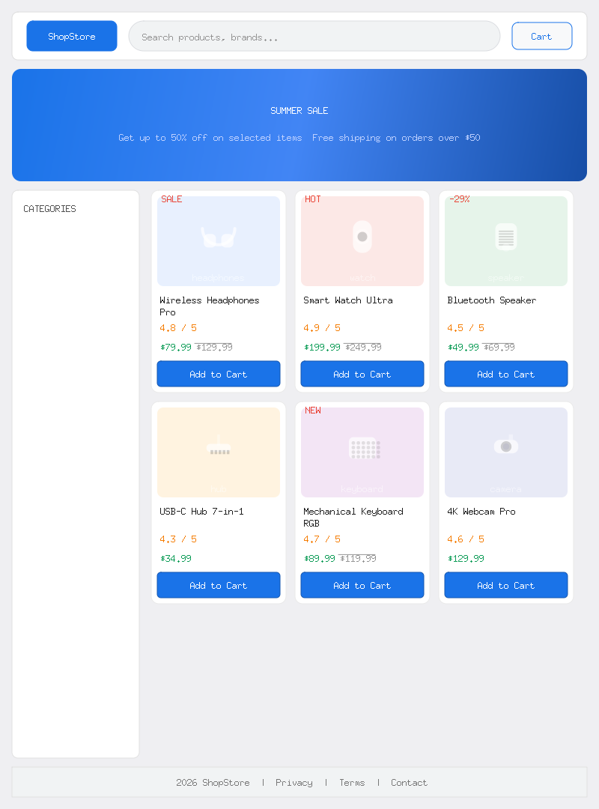

# Goda

[](https://pkg.go.dev/github.com/raitucarp/goda)
[](https://goreportcard.com/report/github.com/raitucarp/goda)
[](LICENSE)

Goda is a pure Go port of [Facebook's Yoga](https://github.com/facebook/yoga) layout engine. It implements CSS Flexbox for calculating positions and dimensions of UI elements, making it ideal for custom UI frameworks, game UIs, image generation, and GUI toolkits.

## Features

- **Pure Go** — zero CGo, zero C dependencies
- **CSS Flexbox** — flex-direction, justify-content, align-items, flex-wrap, gap, padding, margin, border, aspect-ratio, and more
- **Fluent Builder API** — all setters return `*Node` for chaining
- **CSS String & Map API** — parse CSS-like syntax to configure nodes
- **QML-like RenderFrom** — declarative tree-building from extended CSS syntax
- **Node identity** — optional `id` and `classes` on every node
- **Layout Output** — single `LayoutOut()` call to get position, size, margins, borders, and padding
- **rem/em support** — CSS length units resolved against font-size estimates
- **Pixel grid rounding** — configurable point scale factor
- **Extensible** — custom measure functions, baseline functions, clone callbacks

## Installation

```sh
go get github.com/raitucarp/goda
```

## Quick Start

```go
package main

import (
    "fmt"
    goda "github.com/raitucarp/goda"
)

func main() {
    // Builder pattern
    root := goda.New().
        SetWidth(800).
        SetHeight(600).
        SetFlexDirection(goda.FlexDirectionRow).
        SetPadding(goda.EdgeAll, 16).
        SetGap(goda.GutterAll, 8)

    child := goda.New().
        SetWidth(100).
        SetHeight(50).
        SetFlexGrow(1)

    root.InsertChildNode(child, 0)

    // Calculate layout
    goda.CalculateNodeLayout(root, 800, 600, goda.DirectionLTR)

    // Read results
    lo := child.LayoutOut()
    fmt.Printf("Position: (%.0f, %.0f) Size: %.0fx%.0f\n",
        lo.Left, lo.Top, lo.Width, lo.Height)
}
```

### CSS String API

```go
root := goda.New().ApplyStyleString(`
    display: flex;
    flex-direction: row;
    width: 800;
    height: 600;
    padding: 16;
    gap: 8;
`)

child := goda.New().ApplyStyle(map[string]string{
    "width":        "100",
    "height":       "50",
    "flex-grow":    "1",
    "align-self":   "center",
})
```

### QML-like RenderFrom

```go
source := `
    .card {
        display: flex;
        flex-direction: column;
        padding: 12;
    }

    #root[card] {
        width: 800; height: 600; gap: 8;

        #header {
            height: 64; flex-shrink: 0;
        }

        #body {
            flex: 1;
        }
    }
`
roots, err := goda.RenderFrom(source)
root := roots[0]
goda.CalculateNodeLayout(root, 800, 600, goda.DirectionLTR)

// ExportAs round-trips back to the same format
// out := root.ExportAs()
// roots2, _ := goda.RenderFrom(out)
```

### Node Identity

```go
node := goda.New("my_id")
node.AddClass("card")
node.AddClass("highlight")

fmt.Println(node.GetID())        // "my_id"
fmt.Println(node.HasClass("card")) // true
fmt.Println(node.GetClasses())    // ["card", "highlight"]
```

### Chaining Builder + CSS

```go
card := goda.New().
    ApplyStyleString("width: 180; padding: 8;").
    SetFlexGrow(1).
    ApplyStyle(map[string]string{"align-self": "center"})
```

## Supported Properties

| Category | Properties |
|---|---|
| Layout | `display`, `direction`, `position`, `overflow`, `box-sizing` |
| Flex | `flex-direction`, `flex-wrap`, `justify-content`, `justify-items`, `justify-self`, `align-content`, `align-items`, `align-self` |
| Flex factors | `flex`, `flex-grow`, `flex-shrink`, `flex-basis` |
| Dimensions | `width`, `height`, `min-width`, `max-width`, `min-height`, `max-height` |
| Spacing | `margin`, `margin-top/right/bottom/left/horizontal/vertical`, `padding`, `padding-*` |
| Border & Gap | `border`, `border-top/right/bottom/left`, `gap`, `column-gap`, `row-gap` |
| Other | `aspect-ratio` |

Values accept numbers (`100`, `100px`), percentages (`50%`), rem/em (`2rem`, `1.5em`), and keywords (`auto`, `flex`, `center`, `max-content`, `fit-content`, `stretch`).

## Running Tests

```sh
go test ./...
```

## Examples

See [`examples/ecommerce/`](examples/ecommerce/) for a rendered e-commerce page using [fogleman/gg](https://github.com/fogleman/gg) with 4 build modes:

```sh
cd examples/ecommerce
go run .
# Outputs 4 identical layouts built 4 different ways
```

### Showcase — E-Commerce Page (800x1080)

| Builder | CSS String |
|---|---|
|  |  |

| CSS Map | RenderFrom |
|---|---|
|  |  |

All four images render identically — built with builder, CSS string, CSS map, and declarative RenderFrom syntax respectively.

## License

MIT — see [LICENSE](LICENSE) for details.

## Acknowledgments

Goda is a Go port of [Facebook's Yoga](https://github.com/facebook/yoga) layout engine. The algorithm and API design follow Yoga's architecture while adapting to Go idioms (GC-managed memory, builder patterns, native error handling).
